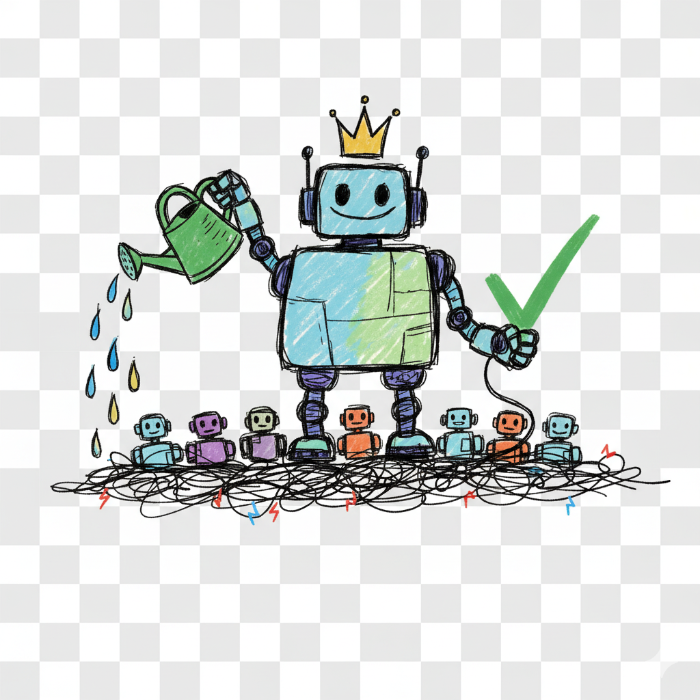

# MCP example 
An example MCP service.



## Exposing an agent

**Any microservice can expose an agent — it does not have to be an MCP microservice.** Exposing agents and exposing MCP servers are independent mechanisms: a microservice that serves no tools at all can still ship agents. This example combines the two only because it happens to have a tool to point the agent at.

Declare the agents in the `agents` map of `manifest.json`, where the key is the agent name and the value is the path its definition is served at:

```json
"agents": {
  "example-agent": "agents/example-agent.json"
}
```

Cumulocity AI Agents reads that map from the application manifest and fetches each definition over HTTP from `/service/<contextPath>/<path>` — here, `/service/mcp-example-http/agents/example-agent.json`. A microservice has no hosted files, so it has to serve that path itself: [`AgentsController`](src/agents/agents.controller.ts) returns [`example-agent.json`](src/agents/example-agent.json).

The definition:

```json
{
  "name": "example-agent",
  "type": "text", // Required, "text" or "object". Agents are listed per type
  "availability": "SHARED", // Set by the platform for application-delivered agents: shown as subscribed and read-only in the UI
  "mcp": [ // Optional - omit it entirely for an agent that needs no tools
    {
      "serverName": "mcp-example-http-exposed-server", // Must match a MCP server configured in the tenant
      "tools": ["c8y-hello-world-http"] // Optional - all tools of the server are used if omitted
    }
  ],
  "agent": {
    "system": "You are a friendly example assistant...",
    "temperature": 0.3 // Plus any other generateText option, e.g. model
  }
}
```

For a MCP server exposed from a manifest, `serverName` is the `exposeMcpServers[].name` verbatim. No `provider` is set here, so the agent uses the tenant's global provider.

Resolving agents from microservices requires [c8y-ai-agents#772](https://github.com/Cumulocity-IoT/c8y-ai-agents/pull/772) — before that, only hosted web applications could expose agents.

## Requirements

- Node.js 24
- Yarn (via corepack)

## Development Workflow

### Pull Requests

Every PR automatically builds the microservice to verify it compiles successfully. Draft PRs are skipped unless labeled with `run-ci-on-draft`.

## Local Development

```bash
yarn start:dev
```

## Build as Microservice

```bash
yarn docker:build
```

## Release Process

This project uses semantic versioning with manual release triggers. See [BUILD_AND_RELEASE.md](docs/BUILD_AND_RELEASE.md) for details.

**Quick start:**
1. Push commits to `main` following [Conventional Commits](https://www.conventionalcommits.org/) format
2. Manually trigger the "Semantic-Release" workflow in GitHub Actions
3. The workflow analyzes commits, creates a version tag, and triggers the build
4. Use `feat:` for features, `fix:` for bug fixes, `BREAKING CHANGE:` for breaking changes